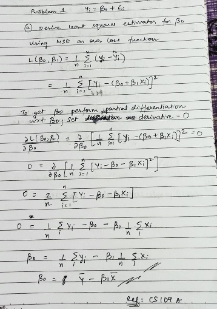
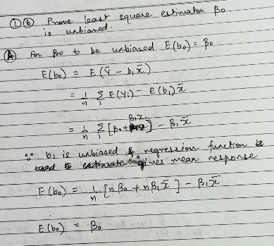
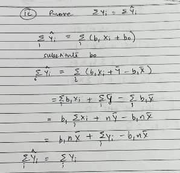
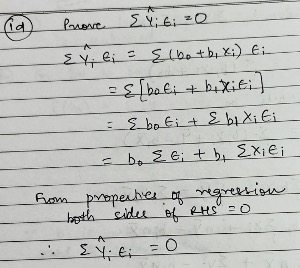

```{r setup, include=FALSE}
knitr::opts_chunk$set(echo = TRUE)
```

### Due Date: September 21, 2020 at 7:20 pm EST
### Instructions

Students should submit their reports on Canvas. The report needs to clearly state what question is being solved, step-by-step walk-through solutions, and final answers clearly indicated. Please solve by hand where appropriate.

Please submit two files: (1) a R Markdown file (.Rmd extension) and (2) a PDF document, word, or html generated using knitr for the .Rmd file submitted in (1) where appropriate. Please, use RStudio Cloud for your solutions.

----------------------------------------------------

## Problem 1

Refer to the regression model $Y_{i} = \beta_{0} + \epsilon_{i}$. (25pts)

a-) Derive the least squares estimator of $\beta_{0}$ for this model.(10pts) 



b-) Prove that the least squares estimator of $\beta_{0}$ is unbiased.(5pts) 



c-) Prove that the sum of the Y observations is the same as the sum of the fitted values.(5pts) 



d-) Prove  that the sum of the residuals weighted by the fitted values is zero.(5pts) 



## Problem 2

Refer to the Grade point average Data. The director of admissions of a small college selected 120 students at random from the new freshman class in a study to determine whether a student's grade point average (GPA) at the end of the freshman year (Y) can be predicted from the ACT test score (X). (30 points, each part is 5 points)

a-) Obtain a 99 percent confidence interval for $\beta_{1}$. Interpret your confidence interval. Does it include zero? Why might the director of admissions be interested in whether the confidence interval includes zero?

```{r}
library(knitr)

rm(list = ls())
# read in data
#gpa <- read.csv("/cloud/project/HW1/Grade Point Average Data.csv")
gpa <- read.csv("~/OneDrive/courses/e106/HW/HW2/Grade Point Average Data.csv")
colnames(gpa) = c('student_gpa', 'act_score')
head(gpa)

# fit regression, obtain coefficients and residuals
reg_q2 <- lm(student_gpa~act_score, data = gpa)
confint(reg_q2, level = 0.99)

```

As seen above the 99% confidence interval (CI) for $\beta_1$ which is the ACT score is is 0.005385614 < $\beta_1$ < 0.07226864. 

This confidence interval does not include zero. 

The director of admisions will be interested in checking if the CI includes zero is to determine at a glance if the intercept is statistically significant. In hypothesis testing terms this would be set up as a 2 sided test with $H_0 = 0$ and $H_a\neq 0 $

b-) Test, using the test statistic $t^{*}$, whether or not a linear association exists between student's ACT score (X) and GPA at the end of the freshman year (Y). Use a level of significance of $\alpha=0.01$. State the alternatives, decision rule, and conclusion.

```{r}
library(knitr)

qt(1-0.01, nrow(gpa)-2)

summary(reg_q2)

```

The  t-test statistic value for $\alpha = 0.01$ from the summary above is 3.040

Null Hypothesis $H_o : \beta_1 = 0$ ACT score is not significant
Alternate hypothesis $H_a : \beta_1 \neq 0$ ACT score is significant

Decision Rule: 

we should reject $H_0$ if $\lvert t_{obs} \rvert$ > t(1-$\alpha/2$; n-2)
we should fail to reject $H_0$ if $\lvert t_{obs} \rvert \leqslant$  t(1-$\alpha/2$; n-2)

Conclusion: 

From the regression summary we see that $\lvert t \rvert$ for the coefficient of percentage of high school graduates is 3.040; this is greater than the desired t-value of 2.358365. Hence, we reject $H_0$ and conclude that the relation is significant

c-) What is the P-value of your test in part (b)? How does it support the conclusion reached in part (b)?

```{r}
library(knitr)

1-pt(1-2.358365, nrow(gpa)-2)

```

The P-value of the test in part(b) is 0.00292 which is less than the p-value for $\alpha = 0.01$ and we can reject $H_0$. Hence, the conclusion in 2c supports that in 2b

d-)Obtain a 95 percent interval estimate of the mean freshman GPA for students whose ACT test score is 28. Interpret your confidence interval.

```{r}
library(knitr)

predict(reg_q2, data.frame(act_score = 28), interval = 'confidence')

```
The 95% confidence interval and predicted GPA for students who have ACT score of 28 is calculated above. 

This means that in 95% of tries we will get GPA values between 3.061384 and 3.341033; the lower and upper bounds.

e-) Mary Jones obtained a score of 28 on the entrance test. Predict her freshman GPA-using a 95 percent prediction interval. Interpret your prediction interval.

```{r}
library(knitr)

predict(reg_q2, data.frame(act_score = 28), interval = 'prediction')

```

The prediction interval for GPA on the ACT score of 28 is the range in the distribution of GPA wherein most of the observations will fall 

f-) Is the prediction interval in part (e) wider than the confidence interval in part (d)? Should it be?

The prediction interval is wider than the confidence interval. This on account of the fact that the confidence interval predicts the likely range of the mean response while the prediction interval is used to predict the specific response value and there is greater uncertainity associated with this.

g-) Determine the boundary values of the 95 percent confidence band for the regression line when $X_{h}$ = 28. Is your-confidence band wider at this point than the confidence interval in part (d)? Should it be?

```{r}
library(knitr)

predict(reg_q2, data.frame(act_score = 28), level = 0.95, se.fit = TRUE, interval = 'prediction')

w2 = 2*qf(1-0.05, 2, 118)
w = sqrt(w2)
w

l_band <- 3.201209-(w*0.07060873)
u_band <- 3.201209+(w*0.07060873)
conf_band <- c(l_band,u_band)
conf_band
```

The confidence band in part 'f' is wider than the confidence band in part 'd'. 
The confidence interval in part 'd' is an estimate for a specific value. 
The confidence band in part 'g' is a band for the entire regression line and it enables us to see the region in which the entire regression line lies. hence, this is likely to be wider.

## Problem 3

Refer to the Crime rate data. A criminologist studying the relationship between level of education-and crime
rate in medium-sized U.S. counties collected the following data for a random sample of 84 counties;
X is the percentage of individuals in the county having at least a high-school diploma, and
Y is the crime rate (crimes reported per 100,000 residents) last year. (45 points, each part is 5 points)

a-)Obtain the estimated regression function. Plot the estimated regression function and the data. Does the linear regression function appear to give a good fit here? Discuss.

```{r}
library(knitr)

# read in data
#crime <- read.csv("/cloud/project/HW2/Crime Rate.csv")
crime <- read.csv("Crime Rate.csv")
colnames(crime) = c('crime_rate', 'hs_pct')
head(crime)

# fit regression, obtain coefficients and residuals
reg_q3 <- lm(crime_rate~hs_pct, data = crime)
summary(reg_q3)
plot(crime$hs_pct, crime$crime_rate)
abline(reg_q3)

```

As seen from the regression plot and the t-value and p-value from the summary, the values are significant and the predictor variable is relevant for the prediction.

However, the R square is 17% which would mean that the overall linear regression function does not give a good fit here.

b-) Test whether or not there is a linear association between crime rate and percentage of high school graduates, using a t test with $\alpha =0.01$. State the alternatives, decision rule, and conclusion. What is the P-value of the test?

In order to test for a linear relation between the variables we perform a 2 sided t-test with 

Null Hypothesis $H_0$ : $\beta_1$ = 0 
Altenate Hypothsis $H_a$ : $\beta_1$ $\neq$ 0. 

Decision Rule: 

we should reject $H_0$ if $\lvert t_{obs} \rvert$ > t(1-$\alpha/2$; n-2)
we should fail to reject $H_0$ if $\lvert t_{obs} \rvert \leqslant$  t(1-$\alpha/2$; n-2)

Conclusion: 

From the regression summary we see that $\lvert t \rvert$ for the coefficient of percentage of high school graduates is 4.103. This is greater than the desired t-value. Hence, we reject $H_0$ and conclude that the relation is significant

The p-value of the test is 9.57e-05

c-) Estimate $\beta_{1}$, with a 99 percent confidence interval. Interpret your interval estimate.

```{r}
library(knitr)

confint(reg_q3, level = 0.99, interval = 'confidence')

```

The interval estimate has a range of -280.2118 to -60.93856. This means that in 99% of repeated tries $\beta_1$ would fall within this range. 

d-) Set up the ANOVA table.

```{r}
library(knitr)

anova(reg_q3)

```

e-) Carry out the test in part a by means of the F test. Show the numerical equivalence of the two test statistics and decision rules. Is the P-value for the F test the same as that for the t test?

```{r}
library(knitr)

summary(reg_q3)
```

Null Hypothesis $H_o : \beta_1 = 0$; high school diploma is not a significant variable
Alternative Hypothesis $H_{a} : \beta1 \neq 0$; high school diplomai s a significant variable

Decision Rule:
Large values of F* ==> conclude $H_a$
Values of F* near 1 ==> conclude $H_o$

Conclusion - As seen from the summary table the F-Statistic has a value of 16.83 which is large and hence we conclude the alternate hypothesis.

The p-value of the test is 9.571e-05; which is the same as that in 2b

f-) By how much is the total variation in crime rate reduced when percentage of high school graduates is introduced into the analysis? Is this a relatively large or small reduction?

```{r}
library(knitr)

ybar <- mean(crime$crime_rate)

# variation due to regression, error and total variation

ssr <- sum((reg_q3$fitted.values - ybar)^2)
ssr
sse <- sum((crime$crime_rate - reg_q3$fitted.values)^2)
sse
ssto <- sse + ssr
ssto

# part explained by high-school graduates
ssr/ssto
```

Total variation is given by ssto = 548736108 which is reduced by 17% when the percentage of high school graduates is introduced into the analysis. 

This is a small reduction

g-) State the full and reduced models.

Full Model

$Y_i = \beta_0 + \beta_1 + \mathcal{E}_i$

crime_rate = 20517.6 - 170.5752 * hs_pct + $\mathcal{E}_i$

Reduced Model - when $H_o$ holds

$Y_i = \beta_0 + \mathcal{E}_i$

crime_rate = 20517.6 + $\mathcal{E}_i$

h-) Obtain (1) SSE(F), (2) SSE(R), (3) dfF. (4) dfR, (5) test statistic F* for the general linear test, (6) decision rule.

```{r}
library(knitr)

sse_f <- sse
sse_r <- ssto
df_f <- nrow(crime) - 2
df_r <- nrow(crime) - 1
test_stat_f_star <- ((sse_r - sse_f)/(df_r - df_f)) / (sse_f/df_f)
test_stat_f_star
```

Decsion rule

if F* $\leqslant F (1 - \alpha; df_R - df_F, df_F)$, conclude $H_o$ or 
if F* $> F (1 - \alpha; df_R - df_F, df_F)$, conclude $H_a$

i-)Are the test statistic F* and the decision rule for the general linear test numerically equivalent to those in part a?

Yes. The test statistic F* and the decision rule for the general linear test numerically equivalent to those in part a